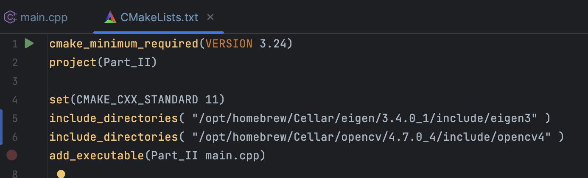
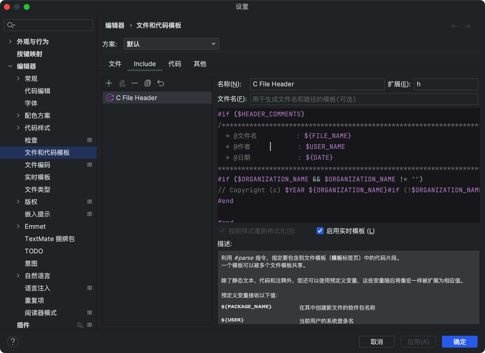
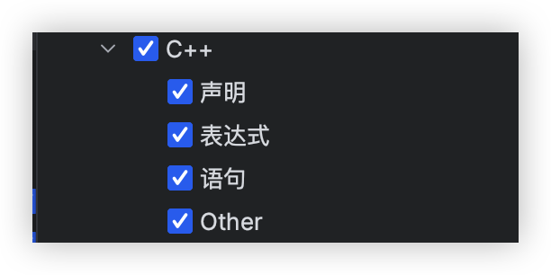
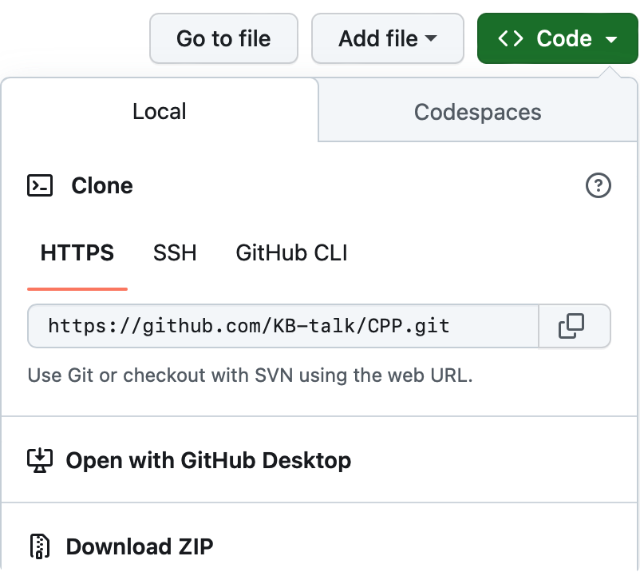

# 开发环境搭建

## 操作系统

MacOS venture13

## 编辑器

clion 2022.3.3

## C++版本

C++11

## 第三方库

使用brew安装第三方库遇到下载速度慢的话，请参考[clash赋予brew新生](https://kb-talk.github.io/2023/05/06/clash赋予brew新生/)。

### Eigen

版本：3.4.0_1

安装方法：

```sh
brew install eigen
```

本机目录：/opt/homebrew/Cellar/eigen/3.4.0_1/include/eigen3

在工程文件中的 `CMakeLists.list`中添加

```
include_directories( "/opt/homebrew/Cellar/eigen/3.4.0_1/include/eigen3" )
```

### OpenCV

版本：4.7.0_4

```sh
brew install opencv
```

本机目录：/opt/homebrew/Cellar/opencv/4.7.0_4/include/opencv4

在工程文件中的 `CMakeLists.list`中添加

```
include_directories( "/opt/homebrew/Cellar/opencv/4.7.0_4/include/opencv4" )
```



# Clion使用篇

## 更改文件注释模版

使用自己的文件注释模版会让自己对文件的内容更为了解，通过下面的更改会自动生成自己喜欢的注释模版，在新建文件时会自动生成，无需手动输入。
1、进入设置
`设置`=>`编辑器`=>`文件和代码模版`
2、更改模版


在模版处输入下面代码

```sh
#if ($HEADER_COMMENTS)
/********************************************************************************
  * @文件名          : ${FILE_NAME}
  * @作者            : $USER_NAME
  * @日期            : ${DATE}
*******************************************************************************/
#if ($ORGANIZATION_NAME && $ORGANIZATION_NAME != "")
// Copyright (c) $YEAR ${ORGANIZATION_NAME}#if (!$ORGANIZATION_NAME.endsWith(".")).#end All rights reserved.
#end
#end
```

## 自动生成函数注释

1、进入设置
`设置`=>`编辑器`=>`实时模版`=>`右侧加号`=>`实时模版`=>`在下方更改信息`
2、添加模版信息
在缩写出填写

```sh
$comments$
```

在描述处填写

```sh
注释
```

在模版文本处填写

```sh
/*!
 * 函数名：
 * 功能: 
 * 参数： 
 * 返回值： 
 */
```

3、在更改处选择C++，选择下图的选项



4、点击应用，完成注释模版添加
5、回到C++编辑界面，在英语输入法下，输入 `$`则会弹出 `$comments$`，按下回车则会自动填入。

## 转到变量声明处

当我们定义了一个变量后，在后期使用时，想要查看变量定义的位置与信息时，按下键盘的command键，使用鼠标左键点击变量即可回到变量声明位置。

# GitHub仓库的使用方法

1、本篇文章使用的代码已经同步上传GitHub仓库，[代码仓库链接](https://github.com/KB-talk/CPP "CPP")，进入GitHub中clone到本地，使用3种方法下载代码都可以。



2、下载到本地后，本代码仓库中包含了多个以Part为名称的文件夹，每一个Part文件夹对应一个工程，在使用Clion进行编译时，进入对应的工程文件后进行编译。不要在CPP文件夹中编译，因为C++是与python不同的，与C语言的工程是相似的，C++的编译是以main.cpp为主文件来进行整个工程的编译的，而python的编译可以只编译当前文件。

# C++基础语法篇

C++基础的头文件为 `#include <iostream>`,目前使用此头文件，后续使用其他头文件时将会说明。

## Part- I：变量与常量的定义与使用

### 变量的定义

我们在定义一个变量时，首先需要确定变量的数据类型。c++中的数据类型有
`整型`：short int、signed short int、unsigned short int、int、signed int、unsigned int、long int、signed long int、unsigned long int

```C++
int num1=10,num2=20,sum;
```

`浮点`：float double long double

```C++
 double d1=1.2,d2=2.3,d3;
```

`字符`：char、signed char unsigned char

```C++
//字符
char ch1='a';
//字符串
char ch2[4]={'a','s','d','\0'};
char ch3[4]="asd";
std::string ch4="zxc";
```

从上述代码可以看出字符是一个单独的变量，而字符串是由字符数组构成的，字符串的定义形式有两种。在定义字符串数组的时候，数组的个数应该至少比字符个数多1。还可以使用 `string`进行字符串的定义。

### 变量的输出

在使用 `iosstrem`头文件时，可以使用 `printf`进行变量的输出。也可以使用 `std::cout<<ch2<<std::endl;`进行输出。个人习惯使用 `printf`进行输出，并不知道使用此方法是不是主流。

**整形输出**

```C++
printf("%d+%d=%d",num1,num2,sum);
```

**浮点型输出**

```C++
printf("%f+%f=%0.3f",d1,d2,d3);
```

在上面代码中有 `%d`和 `%0.3d`两种形式，前者是正常输出浮点数字，后者是输出只保留小数点后三位的浮点数。

**字符输出**

```C++
printf("%c\n",ch1);
printf("%d",ch1);
```

上面代码中使用 `%c`和 `%d`两种输出格式，使用 `%c`输出的是字符本身，使用 `%d`输出的是字符对应的 `ASCII码`。

**字符串的输出**

```C++
printf("%c\n",ch2[2]);
printf("ch2:%s\n",ch2);
std::cout<<ch4<<std::endl;
```

上面的代码使用 `%s`进行字符串的输出，当然也能发现，字符串不仅可以输出整个字符串，也可以单独输出字符串中的某一字符。

### 综合代码

```C++
/********************************************************************************
  * @文件名          : main.cpp
  * @作者            : 张凯博
  * @日期            : 2023/5/7
*******************************************************************************/
#include <iostream>
int main() {
    //整型
    int num1=10,num2=20,sum;    //定义整型
    sum=num1+num2;//整型求和
    printf("%d+%d=%d\n",num1,num2,sum);     //输出求和
    //浮点形
    double d1=1.2,d2=2.3,d3;//定义浮点型
    d3=d1+d2;//浮点求和
    printf("%f+%f=%0.3f\n",d1,d2,d3);//浮点数输出
    //字符
    char ch1='a';//定义一个字符
    printf("%c\n",ch1);//输出字符
    printf("%d\n",ch1);//输出字符对应的整数ASCII
    //字符串
    char ch2[4]={'a','s','d','\0'};//第一种字符串定义
    char ch3[4]="asd";//第二种字符串定义
    std::string ch4="zxc";//第三种字符串定义
    printf("%c\n",ch2[2]);//输出字符串中的一个字符
    printf("ch2:%s\n",ch2);//输出字符串ch2
    printf("ch3:%s\n",ch3);//输出字符串ch3
    std::cout<<ch4<<std::endl;//输出字符串ch4
    return 0;
}
```

**终端输出结果**

```sh
10+20=30
1.200000+2.300000=3.500
a
97
d
ch2:asd
ch3:asd
zxc
```

## Part- II：常用语法

## Part- III：函数的定义

## Part- IV：指针

## Part- V：类

## Part- VI：异常处理

# 字符串日常使用专栏

字符串在日常使用中是非常频繁的，C++对于字符串来说相比于C语言来说，个人感觉是非常的友好的，使用起来与python已经十分的相似了。在使用C语言时，面对字符串的操作是十分困难的。

## 字符串拼接

## 字符串的比较

# Eigen使用篇

# OpenCV使用篇
