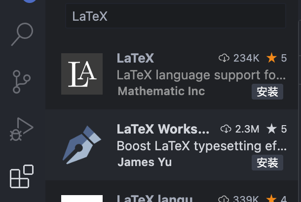
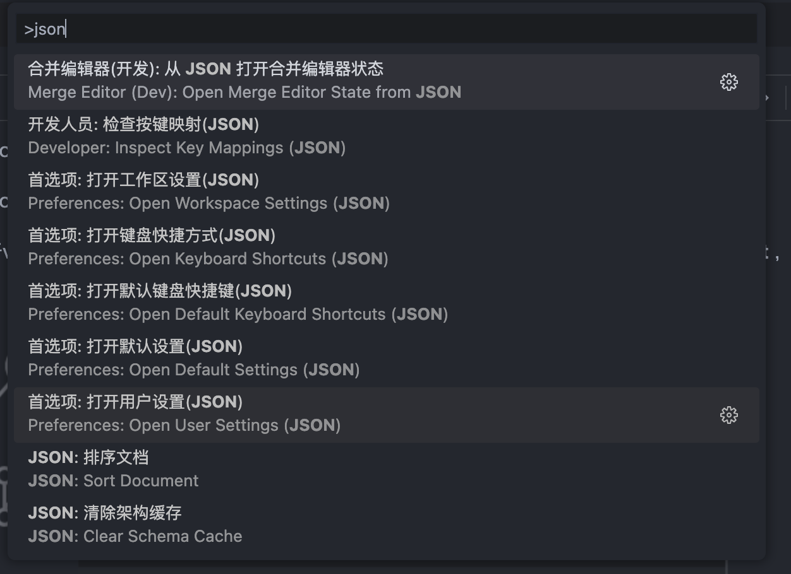

# 相关下载

Mac Latex下载地址：[官网下载链接](https://tug.org/mactex/mactex-download.html)（安装后需要重启）

vs code下载地址：[官网下载地址](https://code.visualstudio.com/Download)

vs code插件：`LaTeX Workshop`

打开vscode，左边工具栏里有个**扩展**栏，选中它！再在搜索框里面搜索 **`LaTeX Workshop`lat** ，如下图所示。



# vs code相关配置

在vscode页面，按下 `f1`，输入 `json`，选择 `首选项`：打开设置这一项，如下图所示。


如果使用vs code配置过其他插件，在其末尾继续添加以下内容(注意：添加时，需要在存在的末尾处添加逗号)：

```js
"latex-workshop.latex.tools": [
    {
        "name": "pdflatex",
        "command": "pdflatex",
        "args": [
            "-synctex=1",
            "-interaction=nonstopmode",
            "-file-line-error",
            "%DOCFILE%"
        ]
    },
    {
        "name": "xelatex",
        "command": "xelatex",
        "args": [
            "-synctex=1",
            "-interaction=nonstopmode",
            "-file-line-error",
            "%DOCFILE%"
        ]
    },
    {
        "name": "bibtex",
        "command": "bibtex",
        "args": [
            "%DOCFILE%"
        ]
    }
],
"latex-workshop.latex.recipes": [
    {
        "name": "xelatex",
        "tools": [
            "xelatex"
        ],
    },
    {
        "name": "pdflatex",
        "tools": [
            "pdflatex"
        ]
    },
    {
        "name": "xe->bib->xe->xe",
        "tools": [
            "xelatex",
            "bibtex",
            "xelatex",
            "xelatex"
        ]
    },
    {
        "name": "pdf->bib->pdf->pdf",
        "tools": [
            "pdflatex",
            "bibtex",
            "pdflatex",
            "pdflatex"
        ]
    }
],
"latex-workshop.latex.clean.fileTypes": [
    "*.aux",
    "*.bbl",
    "*.blg",
    "*.idx",
    "*.ind",
    "*.lof",
    "*.lot",
    "*.out",
    "*.toc",
    "*.acn",
    "*.acr",
    "*.alg",
    "*.glg",
    "*.glo",
    "*.gls",
    "*.ist",
    "*.fls",
    "*.log",
    "*.fdb_latexmk"
],
//tex文件浏览器，可选项为"none" "browser" "tab" "external"
"latex-workshop.view.pdf.viewer": "tab",
//自动编译tex文件
"latex-workshop.latex.autoBuild.run": "onFileChange",
//显示内容菜单：（1）编译文件；（2）定位游标
"latex-workshop.showContextMenu": true,
//显示错误
"latex-workshop.message.error.show": false,
//显示警告
"latex-workshop.message.warning.show": false,
//从使用的包中自动补全命令和环境
"latex-workshop.intellisense.package.enabled": true,
//设置为never，为不清除辅助文件
"latex-workshop.latex.autoClean.run": "never",
//设置vscode编译tex文档时的默认编译链
"latex-workshop.latex.recipe.default": "lastUsed",
// 用于反向同步的内部查看器的键绑定。ctrl/cmd +点击(默认)或双击
"latex-workshop.view.pdf.internal.synctex.keybinding": "double-click",
```

# 功能测试

从IEEE中下载一篇模版，[模版下载链接](https://template-selector.ieee.org/secure/templateSelector/downloadTemplate?publicationTypeId=2&titleId=163&articleId=3&fileId=297)。

使用vs code打开模版，选择编辑器，编辑后在右侧打开pdf进行预览查看。
