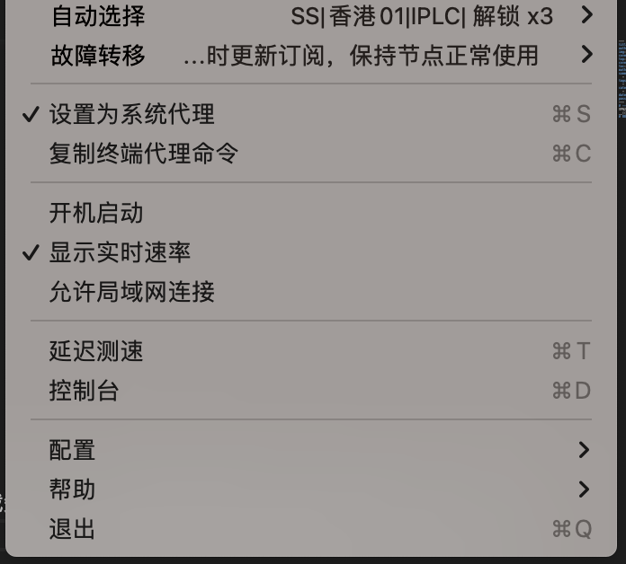
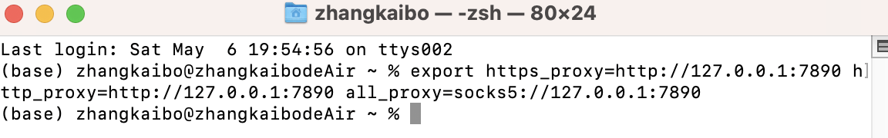

# 前情提要

VPN已经用了很长时间了，经常都是用在访问GitHub，今天在使用brew安装第三方库的时候，经常因为速度下载失败，这时候突然想起能不能用VPN来加速brew下载呢.
使用Clash打开vpn，在使用brew时并没有起到加速作用。在clash中看见一个选项，`复制终端代理命令`。

# 如何使用clash加速brew下载

1.进入clash界面，选择复制终端代理命令

2.打开终端，在终端中输入刚刚复制的命令，按下回车即可

3.接下来使用brew下载即可

此时会发现brew下载会非常的迅速了，不会因为下载速度而失败了。
