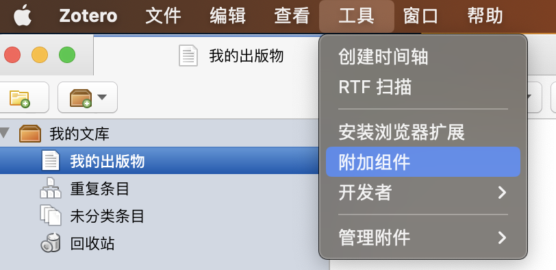
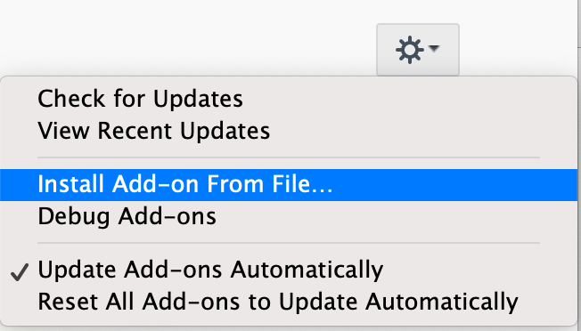
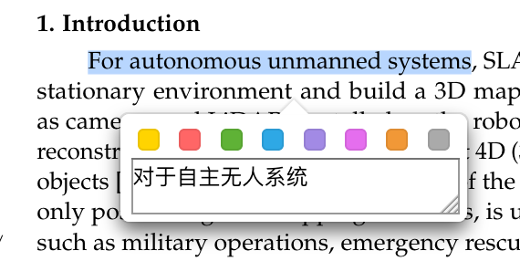
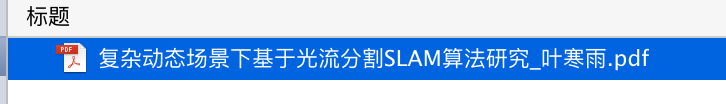
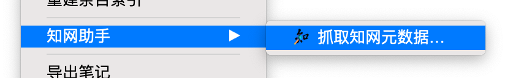
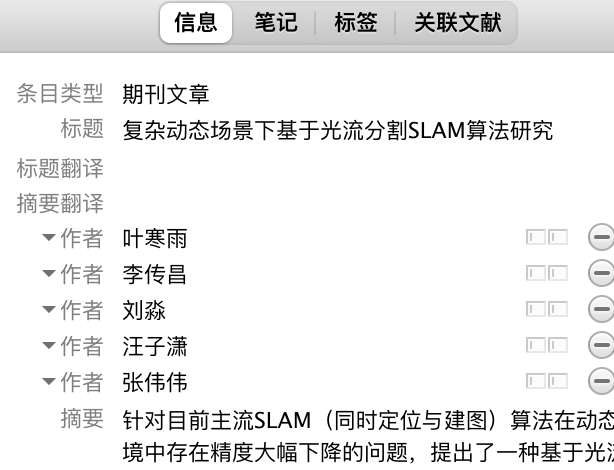
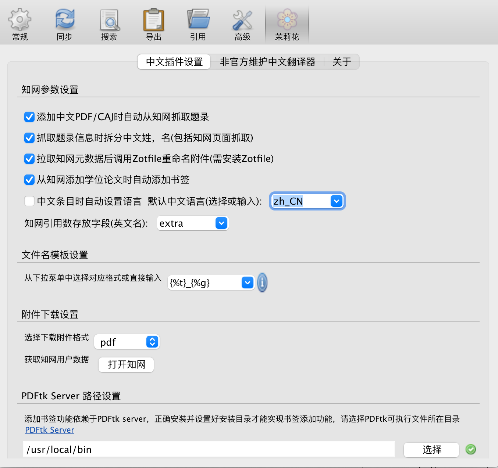
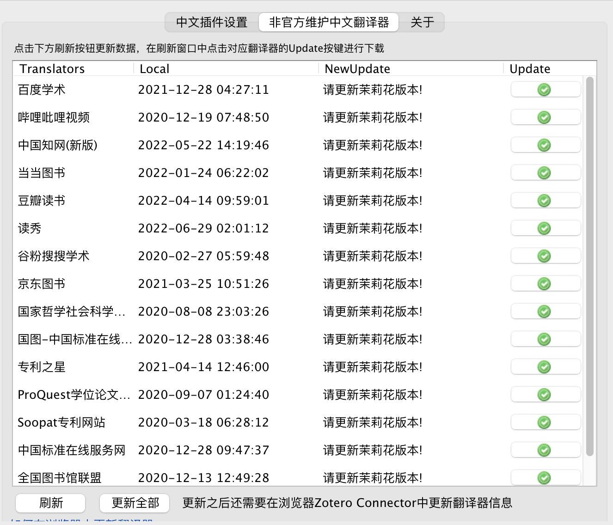
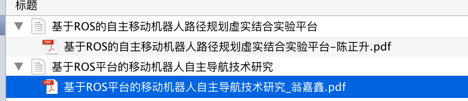
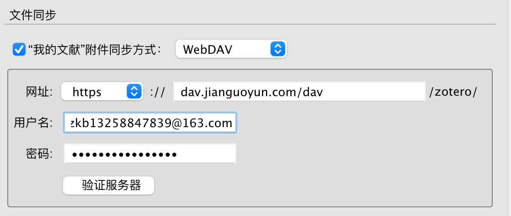

`zetero`是一款开源的文献管理软件，个人账户拥有300M的免费空间，当空间不够时，可以关联自己的私人网盘。

zetero的功能非常的强大。目前，在zetero中可以上传pdf文件，可对文献进行各种分类，自动识别文献的作者、期刊、时间等信息，对英文文献进行翻译，阅读PDF，笔记等功能。

zetero拥有丰富的插件，可以通过各种插件实现各种想要的功能。下面将介绍如何在macOS环境下使用zetero进行文献的管理（windows大同小异），并通过安装插件的方式完善zetero的功能。

# zetero安装

1. 从zetero官网中下载安装包

   [zetero官网](https://www.zotero.org)
2. 根据提示进行安装
3. 在官网注册自己的账号

# zetero插件

zetero拥有很多插件，都在Github上进行了开源，访问GitHub进行下载，本文将附上每个插件对应的GitHub仓库。（访问速度慢，请进行科学上网，或使用GitHub加速软件）

避免链接失效的风险，我将使用到的插件保存到GitHub中作为一个备份，在此GitHub仓库中的插件版本不一定是最新版本获取最新版本的插件，请到各插件详情提供的链接中下载。

[备份插件仓库](https://github.com/KB-talk/zetero_plugs)

## 插件安装方法

1. 下载将要安装的 `插件`，插件的格式为 `xpi`格式。
2. 点击菜单栏中的工具，选择附加组件，点击齿轮，选择从文件添加，选择要添加的插件。`工具——>附加组件——>齿轮——>install Add-on From File——>'插件文件.xpi'`

   

   
3. 重启软件

## 翻译-zotero-pdf-translate.xpi

zetero提供了在阅读英文文献时 `翻译`的插件，支持 `选择翻译`，使用鼠标选取翻译内容即可完成翻译。

使用效果

[zetero翻译插件链接](https://github.com/windingwind/zotero-pdf-translate/releases)

## 笔记-zotero-better-notes.xpi

zetero本身是具有笔记功能的，此插件丰富了zetero本身的笔记功能，可以整理文献中所记录的笔记，可以将笔记以脑图、树图、列表形式展示。

此插件的功能非常强大，还可以与word等软件关联，具体的使用还需进一步的探讨。

## 中文论文信息提取-jasminum-v0.1.8.xpi

zetero本身只能识别出英文文献的信息，通过这个插件，可以自动提取知网数据。

使用效果

正常上传中文文献是没有任何信息的

使用知网助手后

生成对应的信息

安装方法

1. [下载PFDFtk](https://www.pdflabs.com/tools/pdftk-server/)
2. [下载插件](https://github.com/l0o0/jasminum/releases)
3. 安装PDFtk，并记住安装的位置
4. 安装插件，重启软件
5. 打开zetero首选项，按照图片配置，并设置好PDFtk

   
6. 进入非官方维护中文翻译器，点击刷新，再点击更新全部

   
7. 导入中文论文，使用知网助手提取论文信息

## 参考文献-zotero-better-bibtex-6.7.75.xpi

[下载链接](https://github.com/retorquere/zotero-better-bibtex/releases/tag/v6.7.75)

此插件可以生成一个参考文献数据库，可以使用latex以及word进行引用。使用此款插件引用参考文献可以自定义参考文献的格式，且生成的参考文献的序号随着引用的顺序自动更新，当添加新的参考文献或者删除时，可以自动的更新编号，大大的降低了参考文献的引用难度。

# 使用方法

> 参考本文的使用方法，需成功安装上述插件。

## 新建群组、分类

打开 `zetero`,在软件左上角可以选择新建群组和分类。通常个人使用使用的是 `新建分类`，新建分类类似于新建文件夹的功能。`新建群组`是用于团队使用的，在群组中的内容是可以共享的。

## 添加中文文献

1. 下载论文
2. 将下载的论文拖入zetero中
3. zetero将自动识别提取相关信息，若没有自动提取，右键选择 `知网助手`即可

添加后的效果如下：

`可能遇到的问题`：

导入中文参考文献无法提取数据信息

`解决办法`：

1. `更换下载论文的途径`。通过亲身实践，在知网官网下载的论文大概率是可以识别成功的，但是使用其他途径下载的中文论文可能出现失败的情况。
2. `手动添加信息`。具体方法如下，在知网中，选择引用此文献，选择引用Endnote格式，复制到剪切板中，在zetero菜单中选择文件，选择 `从剪切板导入`选项，zetero将完成信息的导入。

> 友情提醒：虽然使用自动识别固然方便，但是也存在出错的情况，完成论文后，亲自检查一下更为稳妥。

## 添加英文文献

使用zetero添加英文文献相对中文文献将更简单一些。将英文文献拖入对应的分类中即可。

## 生成参考文献列表

## 编辑参考文献格式

## 在Latex中调用参考文献列表

有关zetero的使用方法，将陆续的进行更新。

# 使用坚果云配置云同步扩大网盘容量

## 下载并注册坚果云

1.[坚果云下载链接](https://www.jianguoyun.com/s/downloads)，按照提示下载对应版本，并注册账号。 

2.安装完成后，`登录账号`，`选择网页端`，在APP中有个 `地球`的标志。

3.进入网页端后，选择 `账户信息`选项。

4.再选择 `安全选项`，并拉到最后。

5.点击添加应用，名称输入 `zetero`，根据提示点击 `生成应用密码`。坚果云配置完成。

## 配置zetero

1.进入 `zetero首选项`，进入 `同步`界面，更改 `文献同步`选项。

> 坚果云免费版用户容量也是限额的，但是每个月上传为1G，下载为3.6G,对于我们普通备份文献来说够用了。

2.将同步方式改为 `WebDAV`。

3.网址后面输入 `dav.jianguoyun.com/dav`

4.用户名称与密码在坚果云的网页端可以查看到。将对应的信息输入，然后点击 `验证服务器`，会提示生成一个文件夹，点击 `生成`即可。

5.将`所有使用zetero的设备`都是用`WebDAV`进行配置一遍，这样所有的设备都是用的是`坚果云盘`。

## 文献同步
回到 `zetero`中，点击右上角的 `同步`图标进行同步。

